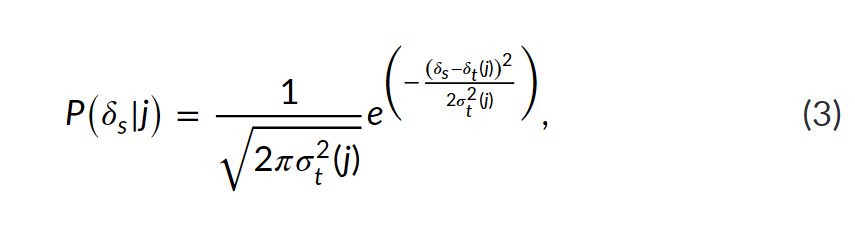

::: {.callout-note appearance="simple" icon="false"}
## In this section

-   **You'll learn:** how the pdRaster function works
-   **You'll need:** the strontium isoscape from Module 2
-   **Time:** about 45 minutes
:::

## Overview

We will explore how to use the assignR package for isotope-based geographic assignment!

::: {.callout-tip icon="false"}
## More resources

-   Ma, C., Vander Zanden, H. B., Wunder, M. B., & Bowen, G. J. (2020). assignR : An R package for isotope‐based geographic assignment. *Methods in Ecology and Evolution*, (00), 1–6. <https://doi.org/10.1111/2041-210x.13426>
-   <https://github.com/SPATIAL-Lab/assignR>
-   <https://spatial-lab.github.io/assignR/>
:::

## Setting up

```{r}
#| label: setup
#| message: false
#| warning: false
library(tidyverse)
library(assignR)
library(terra)
library(rnaturalearth)
library(sf)
library(tidyterra)
library(viridis)
```

## Unknown origin data

Today we will be working with painted lady butterflies collected from various locations in South Africa

```{r}
#| label: bring in unknown data
unknown <- read.csv("Module3_assignment/unknown.csv")
unknown
```

## Strontium isoscape

We will load the strontium ioscape we developed in Module 2

```{r}
#| label: Sr isoscape from Module 2
Sr_iso_mean <- rast("Module3_assignment/rf_all_pred.tif")
Sr_iso_sd <- rast("Module3_assignment/rf_all_sd.tif")
Sr_iso <- c(Sr_iso_mean, Sr_iso_sd)
```

## Map

Let's take a look at a map!

```{r}
#| label: outline of South Africa
#| message: false
#| warning: false
eck <- crs(Sr_iso_mean)
WGS84 <- '+init=EPSG:4326'
sa <- ext(c(16.5, 35, -36, -22)) #(xmin, xmax, ymin, ymax
SA_outline <- rnaturalearth::ne_countries(
  country = c("South Africa", "Lesotho", "Eswatini"),returnclass = "sf") %>%
  sf::st_as_sf(., crs=WGS84) %>%
  st_crop(sa) %>% 
  sf::st_transform(crs=eck) 

unknownxy<-st_as_sf(unknown, coords=c("Lon","Lat"), crs=WGS84)%>% 
         st_transform(crs=eck)

ggplot()+
  geom_spatraster(data=Sr_iso_mean)+ # isoscape - mean prediction
  geom_spatvector(data=SA_outline,fill=NA,colour="black")+ # country outline
  geom_sf(data=unknownxy,pch=1, col="red3",cex=2)+  # butterfly collection sites
  scale_fill_viridis(option="turbo", na.value = NA)+ #pretty colors
  theme_minimal()+ # cute map theme
  theme(legend.position="bottom")+
  theme(legend.key.width=unit(2, "cm"))+
  guides(fill = guide_colourbar(direction = 'horizontal', ##transform legend
                                title="87Sr/86Sr",  ##rename default legend
                                title.position='top',
                                title.hjust=0.5,
                                ticks.colour='#f5f5f2',
                                ticks.linewidth=2,
                                barwidth = 15,
                                barheight = 0.75))  
```

butterflies were collected from the locations marked with red circles.

# Geographic assignment 1

Let's do our first isotope-based geographic assignment, then we will explore how it works!

```{r}
#| message: false
#| warning: false
# prepare unknown for pdRaster
unknown_Sr <- unknown %>%
  dplyr::select(Sample_ID, Sr8786)

# geographic assignment with assignR
Sr_probsurfaces <- assignR::pdRaster(r = Sr_iso, unknown = unknown_Sr)
```

::: callout-warning
## Going Bayesian

The output maps of isotope-based geographic assignment are called "posterior probability surfaces"
:::

## How the pdRaster function works

For each cell, **j**, the liklihood that the butterfly originated from that location is calculated from a probability density function given:

| Symbol | Meaning | Argument in our function |
|----|----|----|
| $\delta_s$ | ⁸⁷Sr/⁸⁶Sr of the butterfly | `sr_sample` |
| $\delta_t(j)$ | isoscape prediction (mean) at cell $j$ | `sr_mean` |
| $\sigma_t(j)$ | prediction uncertainty (SD) at cell $j$ | `sr_sd` |



:::

::: {.callout-caution collapse="true"}
## Code version

```{r}
#| label: sr-likelihood
sr_likelihood <- function(sr_sample, sr_mean, sr_sd) {
  if (any(sr_sd <= 0)) stop("sr_sd (the uncertainty) must be greater than 0.")

  scaling  <- 1 / sqrt(2 * pi * sr_sd^2)               # the fraction: height of the curve
  distance <- (sr_sample - sr_mean)^2 / (2 * sr_sd^2)  # squared distance, scaled by uncertainty
  scaling * exp(-distance)                             # the full equation
}
```

```{r}
#| label: first-try
sr_likelihood(sr_sample = 0.71313, sr_mean = 0.71313, sr_sd = 0.0010)
```
:::

### Let's explore the probability density function!

::: {.callout-tip icon="false"}
## run helper code

```{r}
#| label: plot-helper
#| code-fold: true
#| code-summary: "Show the plotting function"
plot_sr_likelihood <- function(sr_sample, sr_mean, sr_sd) {
  # x-axis: 4 SDs either side of the mean, widened to include the sample
  x_min <- min(sr_mean - 4 * sr_sd, sr_sample - sr_sd)
  x_max <- max(sr_mean + 4 * sr_sd, sr_sample + sr_sd)
  curve <- data.frame(sr = seq(x_min, x_max, length.out = 500))
  curve$likelihood <- sr_likelihood(curve$sr, sr_mean, sr_sd)

  value <- sr_likelihood(sr_sample, sr_mean, sr_sd)
  z     <- abs(sr_sample - sr_mean) / sr_sd   # distance from the mean, in SDs

  ggplot(curve, aes(sr, likelihood)) +
    geom_area(fill = "#1f4e6b", alpha = 0.12) +
    geom_line(colour = "#1f4e6b", linewidth = 0.9) +
    geom_vline(xintercept = sr_mean, linetype = "dashed", colour = "grey50") +
    annotate("segment", x = sr_sample, xend = sr_sample, y = 0, yend = value,
             colour = "#8a3b12", linewidth = 0.8) +
    annotate("point", x = sr_sample, y = value, colour = "#8a3b12", size = 3.5) +
    labs(
      x = expression({}^87 * Sr / {}^86 * Sr),
      y = expression(P(delta[s] ~ "|" ~ j)),
      title = paste("Likelihood =", format(signif(value, 4), big.mark = ",")),
      subtitle = sprintf("Butterfly %.4f | cell mean %.4f | SD %.4f | %.1f SDs from the mean",
                         sr_sample, sr_mean, sr_sd, z)
    ) +
    theme_minimal(base_size = 13)
}
```

```{r}
#| label: first-plot
plot_sr_likelihood(sr_sample = 0.71313, sr_mean = 0.71333, sr_sd = 0.0010)
```
:::

::: {.callout-note appearance="simple"}
The sliders only work on this website. If you're running this page in RStudio, skip the two `{ojs}` chunks below and use `plot_sr_likelihood()` instead.
:::

```{ojs}
//| echo: false
viewof sr_sample = Inputs.range([0.7000, 0.7250], {
  value: 0.7105, step: 0.0001, label: "δs: butterfly", format: x => x.toFixed(4)
})
viewof sr_mean = Inputs.range([0.7000, 0.7250], {
  value: 0.7100, step: 0.0001, label: "δt(j): cell prediction", format: x => x.toFixed(4)
})
viewof sr_sd = Inputs.range([0.0001, 0.0050], {
  value: 0.0010, step: 0.0001, label: "σt(j): uncertainty", format: x => x.toFixed(4)
})
```

```{ojs}
//| echo: false
likelihood = (x, m, s) =>
  Math.exp(-((x - m) ** 2) / (2 * s ** 2)) / Math.sqrt(2 * Math.PI * s ** 2)

value = likelihood(sr_sample, sr_mean, sr_sd)
n_sd  = Math.abs(sr_sample - sr_mean) / sr_sd

curve = d3.range(0.7000, 0.7250, 0.00002)
  .map(x => ({x, y: likelihood(x, sr_mean, sr_sd)}))

md`**Likelihood = ${value.toLocaleString(undefined, {maximumSignificantDigits: 4})}**
· the butterfly is ${n_sd.toFixed(1)} SDs from the prediction
· the curve's peak is ${likelihood(sr_mean, sr_mean, sr_sd).toLocaleString(undefined, {maximumFractionDigits: 0})}`

Plot.plot({
  height: 320,
  marginLeft: 60,
  x: {domain: [0.7000, 0.7250], label: "⁸⁷Sr/⁸⁶Sr", tickFormat: d => d.toFixed(3)},
  y: {label: "P(δs | j)", grid: true},
  marks: [
    Plot.areaY(curve, {x: "x", y: "y", fill: "#1f4e6b", fillOpacity: 0.12}),
    Plot.line(curve, {x: "x", y: "y", stroke: "#1f4e6b", strokeWidth: 2}),
    Plot.ruleX([sr_mean], {stroke: "grey", strokeDasharray: "4,4"}),
    Plot.ruleX([sr_sample], {y1: 0, y2: value, stroke: "#8a3b12", strokeWidth: 2}),
    Plot.dot([{x: sr_sample, y: value}], {x: "x", y: "y", fill: "#8a3b12", r: 6}),
    Plot.ruleY([0])
  ]
})
```

::: callout-note
## Watch the y-axis

The y-axis rescales as you move the sliders, so a curve can look the same height while its peak changes a lot. Read the numbers above the plot to compare.
:::

## Exercises

Use `sr_likelihood()` and `plot_sr_likelihood()` in RStudio, or the sliders above.

### Exercise 1: move the butterfly (δs)

::: {.callout-tip icon="false"}
## 🧩 Your turn

Keep the cell at `sr_sample = 0.7100` and `sr_sd = 0.0010`. Calculate the likelihood for sr_mean of 0.7100, 0.7110, 0.7120 and 0.7130.

1.  Where is the likelihood highest?
2.  How much smaller is it 1, 2 and 3 SDs away?
3.  Does it matter whether the butterfly is above or below the prediction?
:::

::: {.callout-caution collapse="true"}
## Hint

The function works on a vector, so you can give it several butterflies at once: `sr_likelihood(c(0.7100, 0.7110), 0.7100, 0.0010)`.
:::

::: {.callout-caution collapse="true"}
## Solution

```{r}
#| label: ex1-solution
cells <- c(0.7100, 0.7110, 0.7120, 0.7130)
lik <- sr_likelihood(sr_sample = 0.7100, sr_mean = cells, sr_sd = 0.0010)
data.frame(cells = cells,
           sds_away  = (cells - 0.7100) / 0.0010,
           likelihood = round(lik, 1),
           relative_to_peak = round(lik / max(lik), 3))
```

The likelihood is highest when the butterfly matches the prediction exactly. It falls to about 61% one SD away, 14% two SDs away and 1% three SDs away. The difference is squared, so a butterfly 0.0010 *below* the prediction gets exactly the same value as one 0.0010 above.
:::

### Exercise 2: change the uncertainty (σt)

::: {.callout-tip icon="false"}
## 🧩 Your turn

Keep the butterfly at 0.7105 and the cell at 0.7100. Try `sr_sd` values of 0.0002, 0.0005, 0.0010 and 0.0030.

1.  Which uncertainty gives the highest likelihood? Is that what you expected?
2.  Some of these values are much larger than 1. How can a probability be bigger than 1?
:::

::: {.callout-caution collapse="true"}
## Hint

For each `sr_sd`, work out how many SDs the butterfly is from the prediction. Then compare that with the peak height of each curve, `sr_likelihood(0.7100, 0.7100, sr_sd)`.
:::

::: {.callout-caution collapse="true"}
## Solution

```{r}
#| label: ex2-solution
sds <- c(0.0002, 0.0005, 0.0010, 0.0030)
data.frame(sr_sd      = sds,
           sds_away   = 0.0005 / sds,
           peak       = round(sr_likelihood(0.7100, 0.7100, sds), 1),
           likelihood = round(sr_likelihood(0.7105, 0.7100, sds), 1))
```

There are two effects pulling against each other. A small uncertainty makes a tall peak, but the 0.0005 difference then counts as many SDs, so the butterfly falls far down the curve. With `sr_sd = 0.0002` it is 2.5 SDs away, and its likelihood is the lowest of the four. The best value here is `sr_sd = 0.0005`, where the difference is exactly 1 SD.

The values are **probability densities**, not probabilities. A density can be larger than 1, especially for ⁸⁷Sr/⁸⁶Sr, where the uncertainties are tiny numbers. Only the area under the curve has to equal 1.
:::

### Exercise 3: a precise cell vs an uncertain cell

::: {.callout-tip icon="false"}
## 🧩 Your turn

A butterfly measures 0.7100. Which cell is the more likely origin?

-   **Cell A:** prediction 0.7104, uncertainty 0.0002 (precise, but a bit off)
-   **Cell B:** prediction 0.7100, uncertainty 0.0020 (a perfect match, but uncertain)
:::

::: {.callout-caution collapse="true"}
## Solution

```{r}
#| label: ex3-solution
cell_b <- sr_likelihood(0.7100, sr_mean = 0.7100, sr_sd = 0.0020)

c(cell_A_0.7104 = sr_likelihood(0.7100, 0.7104, 0.0002),
  cell_A_0.7106 = sr_likelihood(0.7100, 0.7106, 0.0002),
  cell_B        = cell_b)
```

At 0.7104, Cell A is 2 SDs off but still wins, because its curve is ten times taller.
:::

## From likelihood to posterior probability

The likelihood tells us how well each cell *explains* the butterfly's value. What we really want is the reverse: how probable is it that the butterfly came from cell $j$? Bayes' rule gets us there:

$$
P(j \mid \delta_s) = \frac{P(j)\,P(\delta_s \mid j)}{\sum P(j)\,P(\delta_s \mid j)}
$$

| Term | Name | In plain words |
|------------------|------------------|------------------------------------|
| $P(\delta_s \mid j)$ | likelihood | How well cell $j$ matches the butterfly (Equation 3) |
| $P(j)$ | prior | What we believed about cell $j$ *before* measuring Sr |
| $\sum P(j)\,P(\delta_s \mid j)$ | normalising constant | The same product, added up over every cell in the map |
| $P(j \mid \delta_s)$ | posterior | The probability the butterfly came from cell $j$ |

In words: multiply each cell's likelihood by its prior, then divide by the total across the map. Dividing by the total makes the posterior values add up to 1, so each one is a share of the probability for the whole map.

::: callout-tip
## What do we assume when there is no prior?

If every cell has the same prior, $P(j)$ cancels out of the top and bottom of the equation. The posterior is then just each cell's likelihood divided by the sum of all likelihoods. This is what `pdRaster()` does when you don't supply a prior.
:::

::::::: think-pair-share
### 🦋 Think · Pair · Share

:::::: tps-steps
::: tps-step
**💭 Think** [1 min]{.tps-time}

```{r}
#| label: maps again
#| code-fold: true
#| code-summary: "Show the mapping code"
#| message: false
#| warning: false
ggplot()+
  geom_spatraster(data=Sr_iso_mean)+ # isoscape - mean prediction
  geom_spatvector(data=SA_outline,fill=NA,colour="black")+ # country outline
  geom_sf(data=unknownxy,pch=1, col="red3",cex=2)+  # butterfly collection sites
  scale_fill_viridis(option="turbo", na.value = NA)+ #pretty colors
  theme_minimal()+
  theme(legend.position="bottom")+
  theme(legend.key.width=unit(2, "cm"))+
  guides(fill = guide_colourbar(direction = 'horizontal', ##transform legend
                                title="87Sr/86Sr",  ##rename default legend
                                title.position='top',
                                title.hjust=0.5,
                                ticks.colour='#f5f5f2',
                                ticks.linewidth=2,
                                barwidth = 15,
                                barheight = 0.75))

ggplot()+
  geom_spatraster(data=Sr_iso_sd)+ # isoscape - mean prediction
  geom_spatvector(data=SA_outline,fill=NA,colour="black")+ # country outline
  geom_sf(data=unknownxy,pch=1, col="red3",cex=2)+  # butterfly collection sites
  scale_fill_viridis(option="magma", na.value = NA)+ #pretty colors
  theme_minimal()+
  theme(legend.position="bottom")+
  theme(legend.key.width=unit(2, "cm"))+
  guides(fill = guide_colourbar(direction = 'horizontal', ##transform legend
                                title="sd",  ##rename default legend
                                title.position='top',
                                title.hjust=0.5,
                                ticks.colour='#f5f5f2',
                                ticks.linewidth=2,
                                barwidth = 15,
                                barheight = 0.75))
```

On your own: Look at both maps. Find one region where you'd trust an assignment, and one where you wouldn't. For each, ask yourself:

-   Does ⁸⁷Sr/⁸⁶Sr change a lot over short distances, or stay similar across a big area?
-   Is the uncertainty (SD) low or high?
:::

::: tps-step
**🤝 Pair** [3 min]{.tps-time}

With your neighbour, place your regions in the grid below. Can you find an example for every box? Which box would you most like your study area to be in?
:::

::: tps-step
**📣 Share** [3 min]{.tps-time}

Tell the room about one region, which box it's in, and what a probability map would look like for a butterfly from there.
:::
::::::

|   | **Varied geology** (values change fast) | **Uniform geology** (values change slowly) |
|-------------------|:------------------------:|:-------------------------:|
| low SD | 🎯 ? | 🌫️ ? |
| high SD | 🤔 ? | 🙈 ? |
:::::::

low uncertainty may be due to sampling biases (areas with more samples have lower uncertainty) or bedrock type (carbonate areas have lower uncertainty)

## Summary

::: {.callout-note appearance="simple"}
## Key takeaways

-   The likelihood is highest when the sample matches the prediction, and drops fast beyond about 2 SDs.
-   Smaller uncertainty makes a taller, narrower curve. A precise cell can be the best match, or rule itself out.
:::

```{r}
sessionInfo()
```

# **Next:** [Section 2 →](02-section-priors.qmd)
